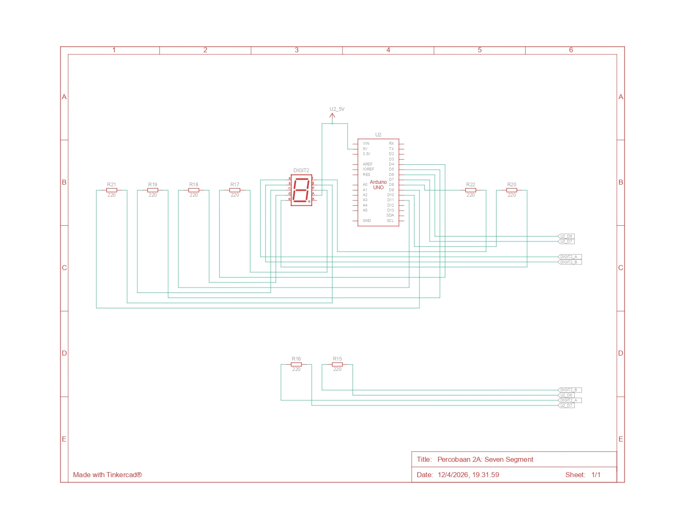
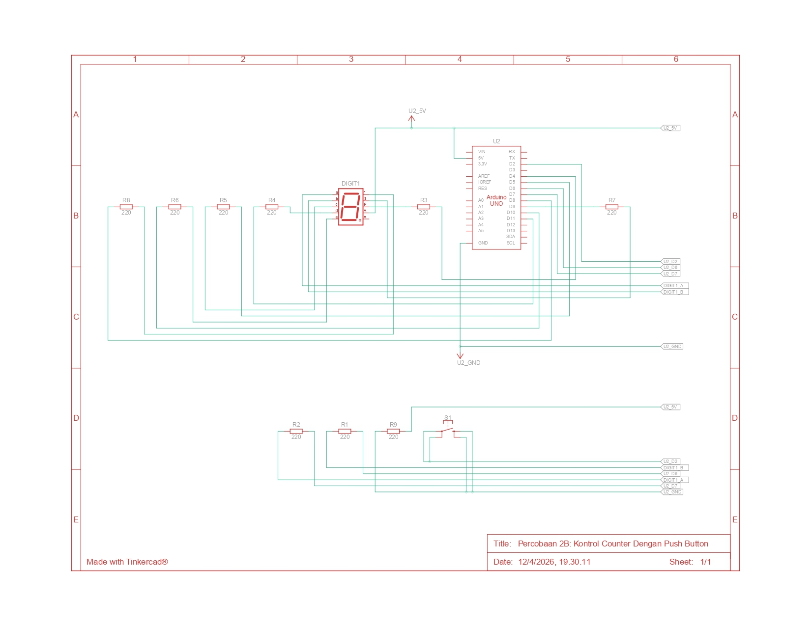

# Jawaban Pertanyaan Praktikum: Modul 2 - Pemrograman GPIO
-----

## 2.5.4 Pertanyaan Praktikum (Percobaan 2A: Seven Segment)

**1. Gambarkan rangkaian schematic yang digunakan pada percobaan\!**

**Jawab:**



-----

**2. Apa yang terjadi jika nilai num lebih dari 15?**

**Jawab:** Variabel `digitPattern` dideklarasikan sebagai array dua dimensi dengan ukuran 16 baris (indeks 0 hingga 15). Jika nilai `num` dikirim lebih dari 15 (misalnya 16), program C++ pada Arduino akan mengalami *out-of-bounds array access*. Arduino akan mencoba membaca memori acak di luar rentang array tersebut. Hal ini dapat menyebabkan:

  * *Seven segment* menampilkan pola cahaya yang tidak menentu (*error*).
  * Nilai sampah (*garbage value*) dari memori ditampilkan.
  * Dalam kondisi ekstrem, mikrokontroler bisa mengalami *crash* atau *restart*.

-----

**3. Apakah program ini menggunakan common cathode atau common anode? Jelaskan alasannya\!**

**Jawab:** Program ini secara dasar dirancang untuk **Common Cathode (CC)**.

  * **Alasannya:** Berdasarkan logika pada array `digitPattern`, angka `1` digunakan untuk menyalakan segmen (HIGH). Pada *Common Cathode*, segmen akan menyala jika diberi tegangan HIGH (5V) karena kutub negatifnya (katoda) terhubung ke Ground.

-----

**4. Modifikasi program agar tampilan berjalan dari F ke 0 dan berikan penjelasan disetiap baris kode nya\!**

**Jawab:**
Berikut adalah kode yang telah dimodifikasi agar melakukan hitung mundur (*countdown*) dari F ke 0:

```cpp
// Pin mapping segment (a, b, c, d, e, f, g, dp)
const int segmentPins[8] = {7, 6, 5, 11, 10, 8, 9, 4};

// Pola digit 0-F (Urutan: a, b, c, d, e, f, g, dp)
byte digitPattern[16][8] = {
  {1,1,1,1,1,1,0,0}, //0
  {0,1,1,0,0,0,0,0}, //1
  {1,1,0,1,1,0,1,0}, //2
  {1,1,1,1,0,0,1,0}, //3
  {0,1,1,0,0,1,1,0}, //4
  {1,0,1,1,0,1,1,0}, //5 
  {1,0,1,1,1,1,1,0}, //6
  {1,1,1,0,0,0,0,0}, //7
  {1,1,1,1,1,1,1,0}, //8
  {1,1,1,1,0,1,1,0}, //9
  {1,1,1,0,1,1,1,0}, //A
  {0,0,1,1,1,1,1,0}, //b
  {1,0,0,1,1,1,0,0}, //C
  {0,1,1,1,1,0,1,0}, //d
  {1,0,0,1,1,1,1,0}, //E
  {1,0,0,0,1,1,1,0}  //F
};

void displayDigit(int num) {
  for(int i=0; i<8; i++) {
    // Membalik logika 1 jadi 0 atau sebaliknya agar sesuai hardware
    digitalWrite(segmentPins[i], !digitPattern[num][i]);
  }
}

void setup() {
  for(int i=0 ;i<8; i++) {
    pinMode(segmentPins[i], OUTPUT); // Mengatur semua pin segmen sebagai OUTPUT
  }
}

void loop() {
  // MODIFIKASI: Perulangan menurun dari indeks 15 (F) ke 0
  for(int i=15; i>=0; i--) {
    displayDigit(i);  // Menampilkan karakter berdasarkan indeks i
    delay(1000);      // Jeda 1 detik sebelum berganti ke karakter berikutnya
  }
}
```

-----

## 2.6.4 Pertanyaan Praktikum (Percobaan 1B: Kontrol Counter Dengan Push Button)

**1. Gambarkan rangkaian schematic yang digunakan pada percobaan\!**

**Jawab:**



**2. Mengapa pada push button digunakan mode INPUT\_PULLUP pada Arduino Uno? Apa keuntungannya dibandingkan rangkaian biasa?**

**Jawab:** Mode `INPUT_PULLUP` mengaktifkan resistor internal (20kΩ-50kΩ) di dalam mikrokontroler yang menghubungkan pin ke tegangan 5V.

  * **Keuntungan:**
    1.  **Efisiensi Komponen:** Tidak memerlukan resistor eksternal di *breadboard*, sehingga rangkaian lebih ringkas.
    2.  **Stabilitas Sinyal:** Mencegah kondisi *floating* (sinyal mengambang), sehingga pin secara stabil membaca HIGH saat tombol dilepas dan LOW saat tombol ditekan.

**3. Jika salah satu LED segmen tidak menyala, apa saja kemungkinan penyebabnya dari sisi hardware maupun software?**

**Jawab:**

  * **Hardware:**
      * LED pada segmen tersebut sudah putus/rusak.
      * Jalur kabel *jumper* putus atau kendur.
      * Nilai resistor terlalu besar atau kaki resistor tidak terpasang sempurna.
      * Salah menghubungkan nomor pin Arduino ke kaki *seven segment*.
  * **Software:**
      * Salah mendefinisikan nomor pin dalam array `segmentPins`.
      * Kesalahan logika (angka `0` seharusnya `1`) pada `digitPattern` untuk segmen tertentu.
      * Lupa mengatur pin tersebut sebagai `OUTPUT` pada fungsi `setup()`.

**4. Modifikasi program dengan dua push button (Increment & Decrement)**

**Jawab:**
Berikut adalah modifikasi sistem counter dengan dua tombol (Pin 2 untuk Tambah, Pin 3 untuk Kurang):

### Source Code Modifikasi 2 Push Button

```cpp
const int segmentPins[8] = {7, 6, 5, 11, 10, 8, 9, 4};
const int btnUp = 2;   // Pin untuk tombol Tambah
const int btnDown = 3; // Pin untuk tombol Kurang

int counter = 0;
bool lastBtnUpState = HIGH;
bool lastBtnDownState = HIGH;

byte digitPattern[16][8] = {
  {1,1,1,1,1,1,0,0}, {0,1,1,0,0,0,0,0}, {1,1,0,1,1,0,1,0}, {1,1,1,1,0,0,1,0},
  {0,1,1,0,0,1,1,0}, {1,0,1,1,0,1,1,0}, {1,0,1,1,1,1,1,0}, {1,1,1,0,0,0,0,0},
  {1,1,1,1,1,1,1,0}, {1,1,1,1,0,1,1,0}, {1,1,1,0,1,1,1,0}, {0,0,1,1,1,1,1,0},
  {1,0,0,1,1,1,0,0}, {0,1,1,1,1,0,1,0}, {1,0,0,1,1,1,1,0}, {1,0,0,0,1,1,1,0}
};

void displayDigit(int num) {
  for(int i=0; i<8; i++) {
    digitalWrite(segmentPins[i], !digitPattern[num][i]);
  }
}

void setup() {
  for(int i=0; i<8; i++) pinMode(segmentPins[i], OUTPUT);
  pinMode(btnUp, INPUT_PULLUP);
  pinMode(btnDown, INPUT_PULLUP);
  displayDigit(counter);
}

void loop() {
  bool currentBtnUpState = digitalRead(btnUp);
  bool currentBtnDownState = digitalRead(btnDown);

  // Logika Increment (Tambah)
  if (lastBtnUpState == HIGH && currentBtnUpState == LOW) {
    counter++;
    if(counter > 15) counter = 0;
    displayDigit(counter);
    delay(200); // Debounce
  }

  // Logika Decrement (Kurang)
  if (lastBtnDownState == HIGH && currentBtnDownState == LOW) {
    counter--;
    if(counter < 0) counter = 15;
    displayDigit(counter);
    delay(200); // Debounce
  }

  lastBtnUpState = currentBtnUpState;
  lastBtnDownState = currentBtnDownState;
}
```
